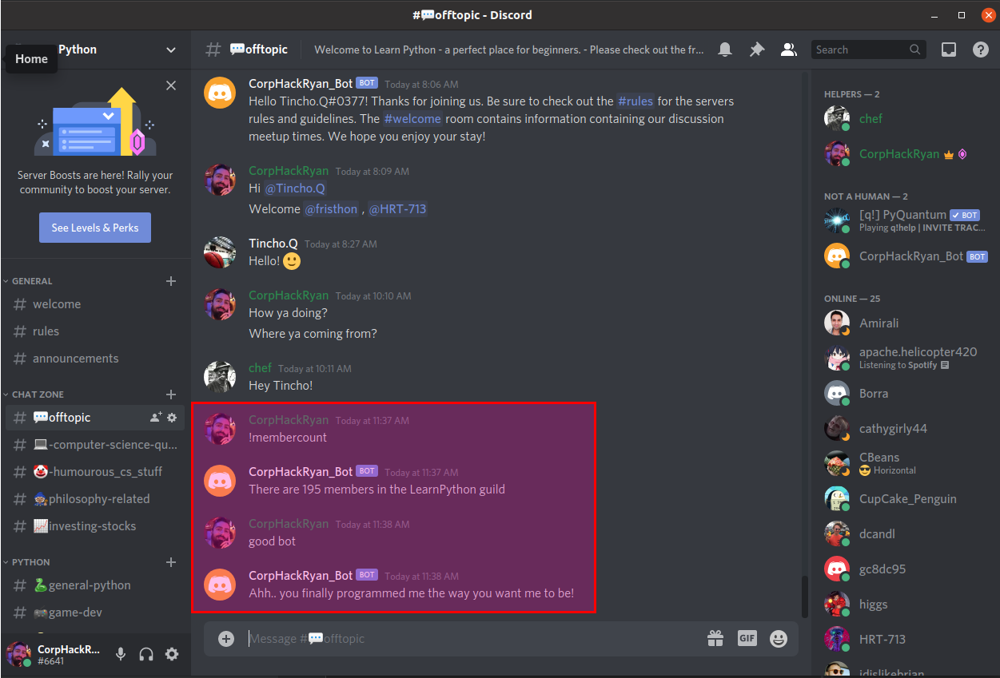

# CorpHackRyan - Discord Bot

Discord bot is a bot that can be hosted on any server and be modified to fit your server needs. I created this bot to experiment with the discord.py functionality. 

Check it out in action at my Learn Python server I created to help people (and myself) to learn python. 

Head over to my Learn Python server on discord -> https://discord.gg/6aRv8ft <- and see the bot in action!

# COMMANDS
!membercount - will return the total members in your 

'bad bot'    - random message sent to channel

'good bot'   - random message sent to channel  

# SCREENSHOTS

